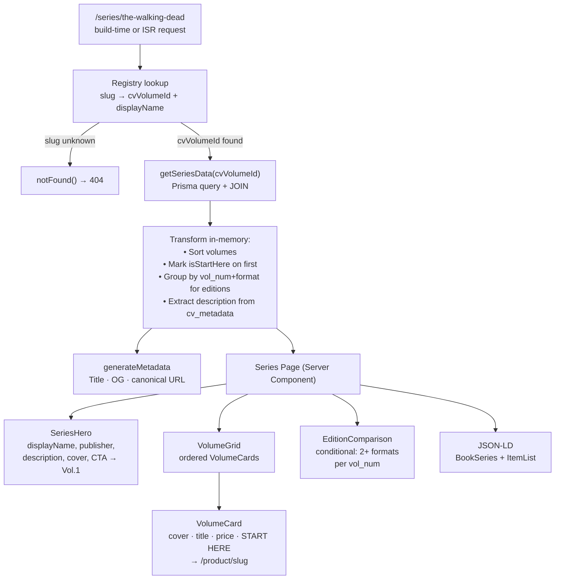
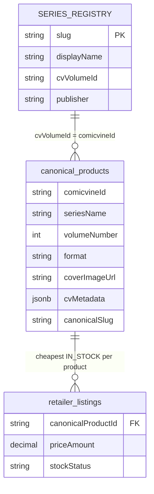

# feat: Series Pages MVP

**Date:** 2026-06-01  
**Depth:** Deep  
**Origin:** `docs/brainstorms/2026-06-01-series-pages-requirements.md`  
**Audit:** `docs/brainstorms/2026-06-01-series-name-audit-requirements.md`

---

## Summary

Build a series hub page at `/series/[slug]` that answers six collector discovery questions — what is this series, where to start, what comes next, which edition, what formats exist, and what does each volume collect. This is the highest-leverage discovery feature identified in the product audit: the structural layer between "I heard about this series" and "I bought the right volume."

The plan covers five confirmed-data-quality launch series (Walking Dead, Fullmetal Alchemist, Invincible, Claymore, Overlord), grouped by CV volume ID as the canonical key. CV IDs were verified against the live database. Internal linking from product pages is included. Internal linking from search result cards is deferred.

---

## Problem Frame

The discovery audit established that the current product has no page answering series-level questions. A collector researching "Absolute Batman" or "Invincible" lands on disconnected product cards with no reading order, no edition comparison, no "start here" signal. This plan creates the missing structural layer.

The data audit revealed the planned launch series (Absolute Batman, Saga, Ultimate Spider-Man) have insufficient series data in the current catalogue. The revised launch set — Walking Dead, Fullmetal Alchemist, Invincible, Claymore, Overlord — has verified clean data: single CV ID per series, 91–100% `volume_number` coverage, 100% `comicvine_id` coverage.

(See origin: `docs/brainstorms/2026-06-01-series-pages-requirements.md`)  
(See audit: `docs/brainstorms/2026-06-01-series-name-audit-requirements.md`)

---

## Requirements

- **R1** A collector landing on `/series/the-walking-dead` can see what the series is, where to start, all volumes in order, and the cheapest current price for each.
- **R2** The page answers "which edition should I buy?" when the same volume exists in multiple formats (architectural requirement; will render empty for the 5 single-format launch series).
- **R3** The page answers "what does this volume collect?" for CV-enriched products.
- **R4** Every volume card links to its `/product/[slug]` page.
- **R5** Product pages in a registered series display a "Part of [Series Name]" back-link.
- **R6** The page is statically generated for 5 known series with ISR at 1 hour.
- **R7** Unknown slugs return 404.
- **R8** The page is SEO-optimised with correct title, meta description, canonical URL, and JSON-LD structured data.
- **R9** No new database table, schema migration, or pricing logic changes.

---

## Key Technical Decisions

**KTD1 — CV volume ID as the primary grouping key, not `series_name` text**

The DB query groups products by `comicvine_id` (WHERE comicvine_id = :cvVolumeId) rather than by `series_name` text matching. The audit showed that all fragmented series share a single CV ID across naming variants — querying by CV ID returns all volumes regardless of `series_name` capitalisation inconsistencies. The five MVP series CV IDs are known and verified: Walking Dead `18166`, Fullmetal Alchemist `20515`, Invincible `17993`, Claymore `21739`, Overlord `91727`.

*Alternative considered:* Query by normalised `series_name` text (LOWER(series_name) = LOWER(:name)). Rejected because it still requires the capitalisation fix as a prerequisite and misses edge cases where a product has null `series_name` but a valid `comicvine_id`. CV-ID query is more precise and fulfils the user's stated intent.

**KTD2 — Hardcoded registry with verified CV IDs, not auto-discovery**

A static registry file maps `slug → { displayName, cvVolumeId, publisher }`. The display name comes from the registry, not from the database, ensuring clean presentation regardless of `series_name` casing in individual products.

*Alternative considered:* Runtime auto-discovery (query DB for top series by product count, build registry dynamically). Rejected for MVP — introduces risk of wrong groupings, slower page generation, and unclear failure modes. The 5-entry registry is auditable and safe.

**KTD3 — ISR at 1 hour, `generateStaticParams` for 5 known slugs**

Same caching posture as product pages. Unknown slugs return `notFound()` immediately (no DB query). Statically generated at build time, refreshed hourly.

**KTD4 — Edition comparison is architecturally included, renders empty for launch series**

All 5 launch series are single-format (TPB only). The edition comparison block — showing "Vol. 1 available as: TPB £14.99 · Hardcover £29.99" — is built and conditionally rendered, but will not appear for the launch series. This means the feature is ready to activate when multi-format series (e.g. Absolute Batman HC+TPB, Invincible Compendium) join the registry.

**KTD5 — Cheapest listing via server-side LEFT JOIN, not client-side price-hint API**

Product pages use the client-side `/api/price-hint` to show eBay prices. Series pages fetch cheapest listings server-side via Prisma JOIN at render time. This is more accurate (our retailer data, not eBay-only), avoids N+1 price-hint fetches for ~30 volume cards, and is consistent with the product page's OffersTable approach.

**KTD6 — Volume ordering: `volume_number` first, `release_date` fallback**

Sort order: `volume_number ASC NULLS LAST`, then `release_date ASC NULLS LAST`, then `title ASC`. Invincible has 1 missing `volume_number`; `release_date` covers it correctly for that one case.

---

## High-Level Technical Design

### Data and render flow



### Registry and query relationship



### `getSeriesData` query shape (directional guidance, not implementation spec)

```
SELECT
  cp.*,
  MIN(rl.price_amount) AS lowest_price,
  rl.price_currency
FROM canonical_products cp
LEFT JOIN retailer_listings rl ON
  rl.canonical_product_id = cp.id
  AND rl.deleted_at IS NULL
  AND rl.price_amount > 0
  AND rl.stock_status IN ('IN_STOCK', 'LOW_STOCK', 'PREORDER')
WHERE cp.comicvine_id = :cvVolumeId
  AND cp.format != 'SINGLE_ISSUE'
  AND cp.deleted_at IS NULL
GROUP BY cp.id
ORDER BY
  cp.volume_number ASC NULLS LAST,
  cp.release_date ASC NULLS LAST,
  cp.title ASC
```

The application layer then:
1. Marks `isStartHere: true` on the first item (lowest volumeNumber / earliest releaseDate)
2. Groups by `volumeNumber` + detects 2+ distinct `format` values → `editionGroups` array
3. Extracts `description` from `cvMetadata.synopsis` of the first enriched product
4. Uses `cover_image_url` from the first item as the series hero cover

---

## Output Structure

```
lib/
  series/
    registry.ts         # 5-entry registry + slug/lookup utilities
    getSeriesData.ts    # Prisma data fetch + transform
    types.ts            # SeriesData, VolumeCardData, EditionGroup interfaces

app/
  series/
    [slug]/
      page.tsx          # Server component: route, ISR, generateStaticParams, generateMetadata, JSON-LD
      _components/
        SeriesHero.tsx
        VolumeGrid.tsx
        VolumeCard.tsx
        EditionComparison.tsx

app/
  product/
    [slug]/
      page.tsx          # Modified: add series back-link in hero

scripts/
  fix-series-name-caps.ts    # Deferred: normalise seriesName capitalisation
  check-mvp-series.ts        # Already created: diagnostic query (keep for future reference)
```

---

## Scope Boundaries

### Deferred to Follow-Up Work
- Internal linking from search result cards (lower impact, more invasive; product back-link covers primary entry path)
- `Series` table and Phase 2 migration
- Ongoing/complete status field (no reliable data source)
- User signals (watcher counts, follows)
- Creator index pages
- Series index browse page (`/series`)
- `seriesName` capitalisation fix script (U6 — not required for 5 MVP series; included as deferred unit)

### Outside This Product's Identity
- User-owned collection state
- "Buy the full series" basket
- Personalised recommendations
- Community reviews on series

---

## Open Questions

| Question | Status |
|---|---|
| Should Invincible Compendiums (different CV ID?) be shown alongside the TPB volumes? | Deferred to implementation — query the DB to check whether compendiums share CV ID `17993` |
| What fallback image should SeriesHero show when Vol.1 has no `coverImageUrl`? | Deferred to implementation — use the NoCoverPlaceholder component already in the codebase |

---

## System-Wide Impact

- **New route:** `/series/[slug]` — server-rendered, ISR
- **New files:** `lib/series/` utility module (no side effects on existing code)
- **Modified file:** `app/product/[slug]/page.tsx` — adds a conditional "Part of [Series]" link in the hero; all existing product page behaviour is unchanged
- **No DB changes**, no API route additions, no pricing/affiliate logic touched
- **SEO:** New canonical URLs gain `BookSeries` + `ItemList` JSON-LD; product pages gain a back-link that improves internal link graph

---

## Implementation Units

### U1. Series registry and slug utilities

**Goal:** Establish the single source of truth for MVP series metadata — the 5 CV IDs, display names, and slug ↔ name conversions.

**Requirements:** R6, R7, R9

**Dependencies:** None — foundational unit

**Files:**
- `lib/series/registry.ts` (create)
- `lib/series/types.ts` (create)
- `lib/series/__tests__/registry.test.ts` (create)

**Approach:**

`registry.ts` exports:
- `SERIES_REGISTRY`: a plain object keyed by slug. Each entry holds `displayName`, `cvVolumeId` (string), and `publisher`. The five entries use the CV IDs verified from the live database.
- `getSeriesEntry(slug: string)`: returns the entry or `null` (used by both the series page and product back-link to gate rendering)
- `seriesNameToSlug(name: string)`: lowercases, replaces non-alphanumeric runs with hyphens, trims. Must be idempotent — running it on an already-slugged value returns the same slug. Used by the product page to derive a slug from `product.seriesName` and check it against the registry.

`types.ts` exports the `SeriesEntry` interface (no runtime logic).

**Patterns to follow:** `lib/images/url-filters.ts` — small utility module with named exports and a focused public surface.

**Test scenarios:**
- `seriesNameToSlug("The Walking Dead")` → `"the-walking-dead"`
- `seriesNameToSlug("The walking dead")` → `"the-walking-dead"` (case-insensitive)
- `seriesNameToSlug("Fullmetal Alchemist")` → `"fullmetal-alchemist"`
- `seriesNameToSlug("YuYu Hakusho")` → `"yuyu-hakusho"` (handles CamelCase)
- `seriesNameToSlug("Is It Wrong to Try to Pick Up Girls in a Dungeon?")` → strips punctuation correctly, no trailing hyphen
- `getSeriesEntry("the-walking-dead")` → returns entry with `cvVolumeId: "18166"`
- `getSeriesEntry("fullmetal-alchemist")` → returns entry with `cvVolumeId: "20515"`
- `getSeriesEntry("unknown-series")` → returns `null`
- `getSeriesEntry("")` → returns `null`
- Round-trip: `seriesNameToSlug("The Walking Dead")` → slug → `getSeriesEntry(slug)` → non-null

**Verification:** All test scenarios pass. `getSeriesEntry` returns null for every slug not in the registry. The five registry slugs map to the correct CV IDs.

---

### U2. Series data query function

**Goal:** Fetch all volumes for a series from the DB, join cheapest listing, transform into typed UI-ready data.

**Requirements:** R1, R2, R3, R4

**Dependencies:** U1 (SeriesEntry type, cvVolumeId)

**Files:**
- `lib/series/getSeriesData.ts` (create)
- `lib/series/__tests__/getSeriesData.test.ts` (create — integration-style, uses real DB shape)

**Approach:**

`getSeriesData(entry: SeriesEntry): Promise<SeriesPageData>` performs a single Prisma raw or query-builder call:

1. Fetches `canonical_products WHERE comicvine_id = entry.cvVolumeId AND format != 'SINGLE_ISSUE' AND deleted_at IS NULL` with a LEFT JOIN to the cheapest in-stock/preorder listing per product (see High-Level Technical Design for query shape).
2. Sorts results in application code: `volumeNumber ASC NULLS LAST`, then `releaseDate ASC NULLS LAST`, then `title ASC`.
3. Marks `isStartHere: true` on the first sorted item.
4. Extracts `description`: iterates products in sort order, returns `cvMetadata.synopsis` (HTML-stripped) from the first product where it's non-empty and meaningfully longer than the `description` field (same heuristic as the product page: `cvSynopsis.length > dbDesc.length + 40`). Falls back to `null`.
5. Extracts `heroCoverUrl`: `coverImageUrl` from the first sorted product that has a non-bad cover (uses `isBadCoverUrl` from `lib/images/url-filters`).
6. Builds `editionGroups`: groups products by `volumeNumber` (or a null-bucket). If any group contains 2+ distinct `format` values, it becomes an `EditionGroup`. For the 5 launch series (all TPB), this array will always be empty.
7. Returns `SeriesPageData`:

```typescript
// Directional guidance — exact shape determined during implementation
interface SeriesPageData {
  displayName: string          // from registry
  publisher: string | null     // from registry
  description: string | null   // from cv_metadata.synopsis, HTML-stripped
  heroCoverUrl: string | null
  volumes: VolumeCardData[]
  editionGroups: EditionGroup[]
}

interface VolumeCardData {
  slug: string               // canonicalSlug
  title: string
  volumeNumber: number | null
  format: string             // ProductFormat enum value
  coverUrl: string | null
  lowestPrice: number | null
  currency: string           // 'GBP' | 'USD'
  inStock: boolean
  isStartHere: boolean
  collectsSummary: string | null   // future: from CV issue data; null for now
}
```

**Patterns to follow:** `getRelated()` and `getDynamicLinks()` in `app/product/[slug]/page.tsx` — server-side Prisma functions that run before render, return typed objects.

**HTML stripping:** Reuse the `stripHtml` helper already defined in `app/product/[slug]/page.tsx` — extract it to `lib/utils/text.ts` or duplicate it inline. Either is acceptable; extracting avoids duplication.

**Test scenarios:**
- Querying cvVolumeId `18166` returns 29 Walking Dead products (covers the capitalisation-variant product)
- Querying a valid cvVolumeId with no products → returns empty `volumes` array (not an error)
- Querying cvVolumeId of a series with single issues → SINGLE_ISSUE products are excluded
- Volumes are sorted by `volumeNumber` ascending — Vol. 1 is first
- A product with `volumeNumber = null` sorts after all numbered volumes
- First volume has `isStartHere: true`; no other volume has it
- `lowestPrice` is populated when an IN_STOCK listing exists
- `lowestPrice` is null when no in-stock/preorder listing exists
- Soft-deleted products (`deletedAt IS NOT NULL`) are excluded
- `description` is extracted from the first product with a non-empty CV synopsis
- `description` is null when no products have a CV synopsis
- `editionGroups` is empty for a series where all products share the same format
- `editionGroups` is non-empty when two products share `volumeNumber` but differ in `format` (use mock/seed data to test this case)
- `heroCoverUrl` is null when Vol. 1 has a bad cover URL (`isBadCoverUrl` returns true)
- `heroCoverUrl` falls through to Vol. 2's cover when Vol. 1's cover fails the bad-url check

**Verification:** Unit tests pass. Manual query against Walking Dead confirms 29 products returned, Vol. 1 is first, `isStartHere` is true on it, price is populated, description is populated (CV synopsis is available on WD).

---

### U3. Series page route

**Goal:** The `/series/[slug]` page — server component with ISR, static generation for 5 known slugs, SEO metadata, JSON-LD, and all four UI sections rendered.

**Requirements:** R1, R2, R3, R4, R6, R7, R8

**Dependencies:** U1, U2, U4

**Files:**
- `app/series/[slug]/page.tsx` (create)
- `app/series/[slug]/_components/SeriesHero.tsx` (create — see U4)
- `app/series/[slug]/_components/VolumeGrid.tsx` (create — see U4)
- `app/series/[slug]/_components/VolumeCard.tsx` (create — see U4)
- `app/series/[slug]/_components/EditionComparison.tsx` (create — see U4)

**Approach:**

`page.tsx` is a Next.js async server component.

- `export const revalidate = 3600` — ISR at 1 hour, matching the product page cadence.
- `generateStaticParams`: returns `Object.keys(SERIES_REGISTRY).map(slug => ({ slug }))` — 5 entries.
- `generateMetadata({ params })`: async, awaits params, looks up registry entry, returns metadata with:
  - `title: "${entry.displayName} Reading Order & Complete Buying Guide — Catch Comics"`
  - `description`: dynamically populated from `seriesData.description` (first 160 chars) or a constructed fallback: `"${entry.displayName} — ${data.volumes.length} volumes. Start with [Vol.1 title] from [£X]. Compare prices across UK retailers."`
  - `alternates.canonical: /series/${slug}`
  - `openGraph.title`, `openGraph.images` (heroCoverUrl)
- Unknown slug: `if (!entry) notFound()` — called before any DB query.
- JSON-LD: two schema.org objects injected via `<script type="application/ld+json">`:
  1. `@type: "BookSeries"` — name, publisher, numberOfVolumes, url
  2. `@type: "ItemList"` — ordered list of volumes with `@type: "Book"` items, isbn, url, position

**Breadcrumb:** `Home / Series / [displayName]` — consistent with the product page breadcrumb pattern.

**Section rendering:**
```
<Navbar />
<nav> breadcrumb </nav>
<SeriesHero seriesData={data} entry={entry} />
<VolumeGrid volumes={data.volumes} />
{data.editionGroups.length > 0 && <EditionComparison groups={data.editionGroups} />}
```

No client components at the route level — all server-rendered. VolumeCard uses Next.js `<Image>` for R2 covers (same as RelatedCard in the product page) and raw `` for CV/external covers — following the pattern in CVCoverImage.

**Patterns to follow:**
- `app/product/[slug]/page.tsx` — ISR, generateMetadata, JSON-LD injection, breadcrumb, Navbar composition
- `app/layout.tsx` — site metadata structure

**Test scenarios (route-level):**
- `GET /series/the-walking-dead` → 200 with correct HTML
- `GET /series/unknown` → 404
- `generateStaticParams` returns exactly 5 slugs matching SERIES_REGISTRY keys
- `generateMetadata("the-walking-dead")` returns title containing "The Walking Dead Reading Order"
- `generateMetadata("unknown")` → metadata returns `{ title: 'Not Found' }` (matches product page pattern)
- JSON-LD `<script>` contains `@type: "BookSeries"` with correct name
- JSON-LD `ItemList` contains correct number of items matching `data.volumes.length`
- Breadcrumb renders "The Walking Dead" as the current page name
- Page does not render EditionComparison for single-format series
- Page does render EditionComparison when `data.editionGroups.length > 0`

**Verification:** `npm run build` completes without TypeScript errors. `npm run dev` serves `/series/the-walking-dead` correctly. `curl -s http://localhost:3000/series/the-walking-dead | grep "BookSeries"` returns a match. `/series/not-a-real-series` returns 404.

---

### U4. Series page UI components

**Goal:** The four presentational components that make up the series page: SeriesHero, VolumeGrid, VolumeCard, and EditionComparison.

**Requirements:** R1, R2, R3, R4, R8

**Dependencies:** U1, U2, U3 (these components live inside the `/series/[slug]/` route directory)

**Files:**
- `app/series/[slug]/_components/SeriesHero.tsx` (create)
- `app/series/[slug]/_components/VolumeGrid.tsx` (create)
- `app/series/[slug]/_components/VolumeCard.tsx` (create)
- `app/series/[slug]/_components/EditionComparison.tsx` (create)

**Approach:**

**SeriesHero:**
- Dark hero band matching `#111827` — consistent with homepage hero and product page hero.
- Left column: series cover image (heroCoverUrl), fallback to NoCoverPlaceholder.
- Right column: `displayName` as H1, `publisher` subtitle, `description` paragraph (clamped at 4 lines, no expand for MVP), volume count badge ("28 volumes"), "Start Reading →" CTA button linking to first volume's `/product/[slug]`.
- CTA is only rendered when `volumes.length > 0`.
- Cover uses Next.js `<Image>` for R2/known hosts, raw `` for external — follow CVCoverImage pattern (but inline, not importing CVCoverImage which does its own CV API calls).

**VolumeGrid:**
- Responsive grid: 2 columns mobile, 4 columns desktop (adjustable).
- Renders `volumes.map(v => <VolumeCard key={v.slug} volume={v} />)`.
- Section heading: "Reading Order" with volume count.
- Grid uses `overflow: visible` so hover-scale cards don't clip.

**VolumeCard:**
- Cover image (60×90 at rest, 3× hover scale on desktop, `transformOrigin: center center` — same pattern as search result cards and IssueListGrid).
- "START HERE" pill in brand red (#E8272A) on the first card only (`volume.isStartHere`).
- Volume title (truncated to 2 lines).
- Format badge (uppercase, small) — "TRADE PAPERBACK", "HARDCOVER", etc. using `FORMAT_LABELS` from the product page.
- Price: "From £XX.XX" in red when `lowestPrice` is non-null; "Check price →" when null.
- Entire card is a `<Link href={"/product/" + volume.slug}>` (not a `<button>` + router.push) — crawlable.
- No price-hint API call — price comes from server-side data.

**EditionComparison:**
- Section heading: "Edition Comparison".
- One row per `editionGroup` (grouped by volumeNumber). Within each row: "Vol. N: [collectsSummary or 'Collected Edition']" label, then one chip per format showing format name and lowest price.
- Chips link to the relevant product page.
- Each format chip shows a brief one-line format descriptor: "Trade Paperback — Standard softcover", "Hardcover — Premium sewn binding", "Absolute Edition — Oversized with extras". These strings are hardcoded in the component (6 format types, 1 line each).
- Renders `null` when `groups.length === 0`.

**Patterns to follow:**
- `app/product/[slug]/page.tsx` — `RelatedCard`, `LabeledRow`, hero structure
- `app/search/page.tsx` — search result card for cover + title + format badge layout
- `components/IssueListGrid.tsx` — hover scale pattern, overflow visible, `transformOrigin: center center`

**Test scenarios:**
- SeriesHero renders displayName from registry entry (not from any DB field)
- SeriesHero renders "Start Reading" CTA with href containing the first volume's canonical slug
- SeriesHero does not render CTA when `volumes` is empty
- VolumeCard with `isStartHere: true` renders "START HERE" badge
- VolumeCard with `isStartHere: false` does not render "START HERE" badge
- VolumeCard with `lowestPrice: 14.99` renders "From £14.99"
- VolumeCard with `lowestPrice: null` renders "Check price →"
- VolumeCard link href is `/product/${volume.slug}`
- EditionComparison renders nothing (returns null) when `groups` is empty array
- EditionComparison renders one row per editionGroup when groups exist
- VolumeCard covers use Next.js Image for R2 hosts, raw img for external URLs

**Verification:** Visual inspection in browser at `/series/the-walking-dead`. All 28+ volume cards appear in correct order. Vol. 1 has "START HERE" badge. Hovering a card scales it correctly. Clicking a card navigates to the correct product page. EditionComparison section is absent.

---

### U5. Product page back-link

**Goal:** Add a "Part of [Series Name]" link in the product page hero, visible for any product whose `seriesName` maps to a registered series slug.

**Requirements:** R5

**Dependencies:** U1 (registry)

**Files:**
- `app/product/[slug]/page.tsx` (modify)

**Approach:**

In the `ProductPage` server component, after fetching `product`:

```
// Directional guidance only
const seriesSlug = product.seriesName ? seriesNameToSlug(product.seriesName) : null
const seriesEntry = seriesSlug ? getSeriesEntry(seriesSlug) : null
```

In the hero metadata column (`<dl>` block), add a new labeled row above or below "Format":

```
// Directional guidance only
{seriesEntry && (
  <LabeledRow label="Series">
    <Link href={`/series/${seriesSlug}`} className="...hover:text-[#E8272A]...">
      {seriesEntry.displayName} →
    </Link>
  </LabeledRow>
)}
```

The `LabeledRow` component already exists in the product page. The link uses the same hover style as other interactive elements on the page.

**Edge cases:**
- `product.seriesName` is null → no link rendered
- `product.seriesName` is "The walking dead" (wrong case) → `seriesNameToSlug` normalises it → "the-walking-dead" → found in registry → link renders correctly
- `product.seriesName` is "Some Unknown Series" → slug not in registry → no link rendered

**No changes to pricing, affiliate routing, or offer logic.**

**Patterns to follow:** `LabeledRow` in `app/product/[slug]/page.tsx`; `Link` in `RelatedCard` in the same file.

**Test scenarios:**
- Product with `seriesName: "The Walking Dead"` (correct case) → renders "Part of The Walking Dead →" link
- Product with `seriesName: "The walking dead"` (wrong case) → same link rendered (slug normalisation works)
- Product with `seriesName: "Some Unknown Series"` (not in registry) → no Series row in hero
- Product with `seriesName: null` → no Series row in hero
- Series link href is `/series/the-walking-dead` (not `/series/The Walking Dead`)
- Existing product page hero rendering (title, format, publisher, creators, status, character tags) is unchanged — only one new conditional row added

**Verification:** Open a Walking Dead TPB product page in `npm run dev`. "Series: The Walking Dead →" row appears in the hero metadata block. Click it → navigates to `/series/the-walking-dead`. Open a product not in a registered series → no series row in hero.

---

### U6. `seriesName` capitalisation fix script (Deferred)

**Goal:** Normalise `seriesName` capitalisation for the 47 fragmented series identified in the audit.

**Requirements:** R9 (no regressions), data quality improvement

**Dependencies:** None (can run independently)

**Status:** Deferred — not required for the 5 MVP series (CV ID query bypasses the issue). Include here so it lands in the plan rather than being forgotten.

**Files:**
- `scripts/fix-series-name-caps.ts` (create, deferred)

**Approach:**

The script:
1. Loads a hardcoded map of `{ incorrect: string, correct: string }` pairs derived from the audit output (47 pairs, all capitalisation variants).
2. For each pair, runs `UPDATE canonical_products SET series_name = :correct WHERE LOWER(series_name) = LOWER(:incorrect) AND series_name != :correct`.
3. Reports count of updated rows per pair.
4. Dry-run flag (no writes without `--execute` flag).

Run this before expanding the series registry to include series with capitalisation fragmentation (e.g., when adding "Is It Wrong to Try to Pick Up Girls in a Dungeon?" to the registry).

**Test scenarios:**
- Dry run reports correct changes without modifying DB
- After execute, `SELECT DISTINCT series_name FROM canonical_products WHERE LOWER(series_name) = 'the walking dead'` returns exactly 1 row
- Products previously under "The walking dead" are now queryable under "The Walking Dead"

**Verification:** Run dry-run, inspect output, then run with `--execute` after approval.

---

## Risks and Dependencies

| Risk | Severity | Mitigation |
|---|---|---|
| Invincible has 1 product missing `volume_number` | Low | `releaseDate` fallback in sort correctly handles it for this series |
| heroCoverUrl is null on a launch series | Low | NoCoverPlaceholder component handles gracefully; visually degraded but not broken |
| Walking Dead has 1 product with wrong-case `seriesName` | None | CV ID query retrieves it regardless; product back-link also handles via slug normalisation |
| `cv_metadata.synopsis` is not available for some products | Low | description falls back to `null`; SeriesHero renders without description paragraph |
| Cheapest listing JOIN returns null for some volumes | Medium | VolumeCard renders "Check price →" fallback; not a bug, just less useful |
| CV IDs change (Fandom API restructure) | Very Low | IDs are stored in DB on products, not queried from CV at render time; plan is unaffected |

---

## Validation Plan

**Step 1 — Unit tests**

Run `npm run test` (or equivalent). All scenarios in U1 and U2 pass.

**Step 2 — TypeScript**

Run `npx tsc --noEmit`. Zero type errors across all new and modified files.

**Step 3 — Local dev smoke test**

`npm run dev`. Visit each of the following:
- `/series/the-walking-dead` — hero, 28+ volume cards, Vol. 1 "START HERE", prices populated
- `/series/fullmetal-alchemist` — 17 volume cards, correct order
- `/series/invincible` — 11 volume cards
- `/series/claymore` — 11 volume cards
- `/series/overlord` — 10 volume cards
- `/series/not-a-series` — 404 page
- A Walking Dead product page — "Series: The Walking Dead →" link in hero
- A product not in any series — no series row in hero

**Step 4 — SEO verification**

For `/series/the-walking-dead`:
- `<title>` contains "The Walking Dead Reading Order"
- `<meta name="description">` is non-empty
- `<link rel="canonical">` points to `/series/the-walking-dead`
- JSON-LD `<script>` contains `"@type":"BookSeries"` and `"@type":"ItemList"`

**Step 5 — No-regression check on product pages**

Open 3 random product pages not in registered series. Confirm no layout changes, no console errors, no series row in hero.

---

## Estimated Effort

| Unit | Effort |
|---|---|
| U1: Registry + slug utilities | 2–3 hours |
| U2: Series data query | 3–4 hours |
| U3: Series page route (ISR, metadata, JSON-LD) | 3–4 hours |
| U4: UI components (4 components) | 4–6 hours |
| U5: Product page back-link | 1–2 hours |
| Integration, testing, TypeScript | 2–3 hours |
| **Total** | **15–22 hours** |

---

## What NOT to Build Yet

- `Series` database table or any schema migration
- Runtime auto-discovery of series (no automated series grouping from products)
- Series index page (`/series`)
- Search result back-links (deferred per user decision)
- User signals (watcher counts, follows, "X collectors own this")
- "What does this volume collect" populated from CV API (no issue-range data in current `cv_metadata`)
- Ongoing/complete series status
- Related series recommendations
- Creator index pages
- Secondary backfill series (Absolute Batman, Saga, Ultimate Spider-Man) — data not ready; add to registry once backfill runs
